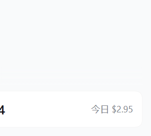
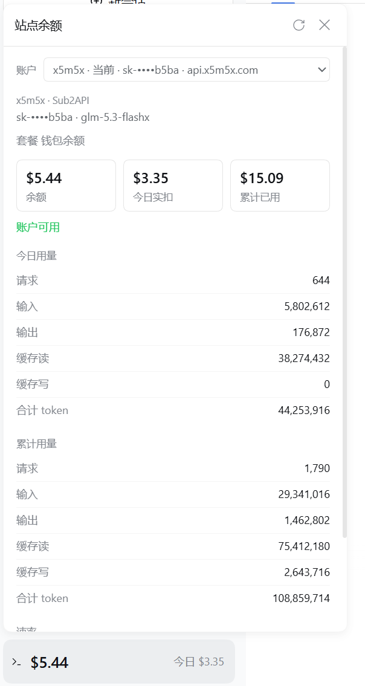

# dsh-gateway-wallet

DeepSeek Harness 侧边栏左下角的「站点余额」：点开后显示**当前路由**在站点账本上的剩余额度和今日实扣，覆盖国内中转（Sub2API / New API）和 DeepSeek 官方，不是本地 token × 单价的估算。

> **v0.2.0 说明**：本版本由社区针对 **DeepSeek Harness 0.2（desktop 0.2.0-rc.1，cordis 4.x）** 完成适配实现——原 0.1.0 只兼容 0.1 系 peer 依赖，无法装入 0.2。适配内容见下方「0.2 适配变更」。

和 [TokenLedger](https://github.com/zh667/TokenLedger)（用量账本）是互补关系：用量账本记的是本机会话里的 token；本插件读的是站点给这把 key 的余额。

显示内容（站点有返回才出现对应行）：

- 当前路由、令牌名、脱敏 Key（`sk-••••xxxx`）；配了多条路由时可切换查看
- 余额、今日实扣、累计已用
- 今日 / 累计 token 桶与请求数
- 套餐名、RPM / TPM
- 余额低于 $1 / ¥5 时，侧边栏按钮打点（侧栏收起时仍能看见）

完整 API Key 只在本机 Host 进程里用作 `Authorization` 头，不会进入浏览器，也不会发到本插件作者的任何服务器。

## 截图

侧边栏入口：余额大字 + 今日实扣同行（跟随当前选中的账户，余额偏低时整行警示色）：



点开后的站点账本（账户切换、余额构成、令牌、用量、速率、读取来源）：



## 安装

需要 DeepSeek Harness 的 `web` profile。

```sh
dsh plugin --profile web add github:MuAllen/dsh-gateway-wallet
```

重启已经在跑的 DSH，浏览器硬刷新。侧边栏底部会出现「站点余额」。

升级或卸载：

```sh
dsh plugin --profile web update dsh-gateway-wallet
dsh plugin --profile web remove dsh-gateway-wallet
```

## 支持的账本

| 站点程序 | 接口 | 说明 |
| --- | --- | --- |
| Sub2API（如部分国内中转） | `GET /v1/usage` | 余额、今日/累计实扣、token 桶 |
| New API / One API 等分支 | `GET /api/usage/token/` | 额度、已用；今日仅日志完整返回时显示。key 额度不限时余额显示为未公布，令牌栏单独标明这把 key 不限 |
| DeepSeek 官方 | `GET /user/balance` | 仅 `api.deepseek.com`：余额；没有今日实扣 |

只使用你已经配给这条路由的普通 API key。打开账本前会用不带密钥的 404/401 探测认出是 Sub2API 还是 New API；对不上的站点会说明原因，**不会按另一套程序换算额度**。

## 0.2 适配变更（v0.2.0）

针对 DeepSeek Harness `0.2.0-rc.1`（`@deepseek-ai/cordis@4.0.4`）逐项核对并改造：

- **peerDependencies**：`@deepseek-ai/cordis` 放宽到 `>=4.0.0-rc.1 <5`；`dsh-client-ui-*` 对齐 `0.2.x`。移除已不存在的 `@deepseek-ai/dsh-client-runtime` 声明（含 `dsh.client.inject`）。
- **Host 端**：`settings.get(ns)` 在 0.2 已移除，改为读取 `configEditor.configuration()` 并合并 `inherited + override` 两层（保留 0.1 的 `settings.get` 作为回退）；`webServer.register({kind:'exact'})`、`llm.listConfigurableProviders()`、`credentials.resolve()` 在 0.2 契约不变，直接沿用。
- **Client 端**：`sidebar.footer.action` 槽位契约不变（owner prop `wide`）。`PropsRuntime` 类型不再由 `dsh-client-ui-slots` 运行时导出，改为本地结构类型，组件只声明实际读取的 props；`useSessions` 标准属性改为可选依赖，缺失时跳过「会话结束自动刷新」。图标跟随 0.2 更名：`IconApiOutline14/IconRefreshOutline14/IconCloseOutline16` → `IconApiOutlineRegular/IconRefreshOutlineRegular/IconCloseOutlineRegular`。
- **构建**：新增跨平台 `build.mjs`（esbuild JS API，替代仅限 macOS 路径的 `build.sh`），client 产物仍是单文件 `window.__ModuleLoader__` CJS bundle，`react` / `react/jsx-runtime` / `@deepseek-ai/dsh-client-ui-primitives` 走 0.2 的种子词 require。

## 免责声明

- 本插件是独立的第三方社区项目，与 DeepSeek、各中转站均无隶属、赞助或背书关系。「DeepSeek」及相关商标归其权利人所有。
- 面板上的金额以站点当时返回为准，不是对账单或税务凭证。接口变更、站点口径或网络失败都可能导致空白或与控制台不一致。
- 本软件按 MIT 许可证「按现状」提供，作者不对使用本插件造成的损失承担责任。

侧边栏按钮的交互参考了 TokenLedger 的 `sidebar.footer.action` 用法。0.2 适配实现在本仓库完成；如你也在用 0.1，可直接锁旧版 tag。

## License

[MIT](LICENSE)
